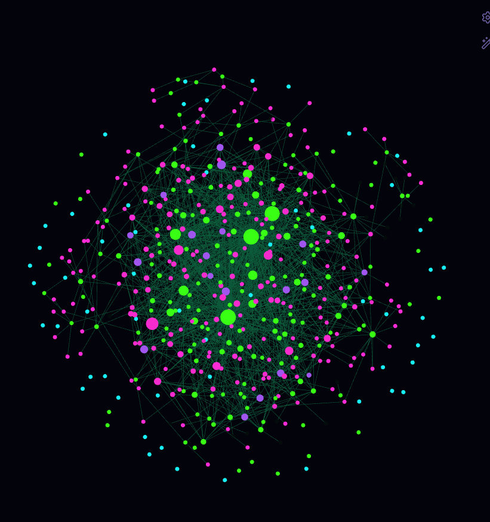
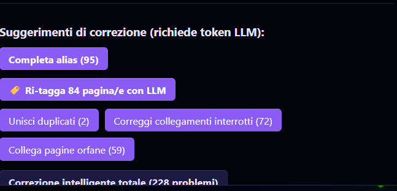
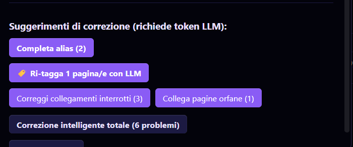

# Da 6 ore a 20 minuti: la mia wiki AI ora si mantiene da sola, a costo zero
## E perché senza testarla a rottura non l'avrei mai saputo



> *Questa è la mia wiki: una rete viva di entità, concetti e fonti che si costruisce e si mantiene da sola.*

La mia wiki in Obsidian era diventata ingestibile. Per processare 15 fonti ci volevano **6 ore** con 4 chat in parallelo sui modelli locali, e anche così era un terno al lotto: processi interrotti a metà, risultati incoerenti, e ogni ingest bulk copiava tag-spazzatura dai commenti del template.

Poi ho provato Gemini al piano gratuito. Il plugin sparava richieste oltre i 15 RPM concessi, prendendosi 429 su 429. Ho aggiunto un rate limiter direttamente nel bundle compilato del plugin e oggi faccio **30 file in 20–30 minuti** con una sola chat, zero errori. Ma la parte interessante non è la soluzione — sono i **cinque fallimenti** che ci sono voluti per arrivarci.

---

## Fallimento 1 di 5: la notte in cui il dedup ha impazzito

Avevo lanciato "Completa alias" sul plugin locale 9B. Il risultato del rilevamento duplicati era: **0 duplicati**. Rilancio: **76**. Rilancio di nuovo: **95**. Stesso modello, stesso dataset, zero modifiche — il detector oscillava come un metronomo rotto.

Ma il bello è cosa considerava "duplicato":
- `persona` = `organizzazione` (un essere umano e un'entità legale sono la stessa cosa)
- `obsidian` = `andrew-carpati` (un'applicazione e il suo sviluppatore sono la stessa entità)
- E in mezzo, tag-spazzatura copiati letteralmente dai commenti del template: `entity # MUST be exactly "entity"` finito come categoria reale nella wiki

Il modello locale 9B produceva **1/3 dei concetti** di Gemini sullo stesso input. Non "un po' meno" — un terzo.

---

## Ostacolo 2 di 5: il vincolo nascosto

Il plugin installato contiene solo file compilati:

| File | Dimensione | Ruolo |
|------|-----------|-------|
| `main.js` | ~81.000 righe | Bundle esbuild con tutto il plugin + dipendenze SDK |
| `manifest.json` | Poche righe | Metadati |
| `data.json` | Poche righe | Impostazioni |
| `styles.css` | Poche righe | Fogli di stile |

Niente `src/`, niente `.ts` separati. Ogni modifica va fatta direttamente sul bundle, e per capire dove intervenire ho dovuto ricostruire mentalmente l'architettura del modulo. Le chiamate LLM passavano tutte da un percorso comune nel SDK vercel-ai: `doGenerate → postJsonToApi → postToApi → fetch()`.

`postToApi` era il punto giusto — ma capire *come* modificarlo ha richiesto di navigare lo scope di esbuild, le closure dell'SDK, e una funzione chiamata `__esm`.

---

## Fallimento 3 di 5: il ReferenceError che ha bloccato tutto

Dopo aver inserito il codice e testato con `node --check` (sintassi OK), ho avviato Obsidian. Il plugin non partiva. Log: **ReferenceError: setLLMRateLimitPerMinute is not defined**.

Ho iniziato a escludere le cause una per una, come una scena investigativa:

**Passo 1 — Controllo sintattico.** `node --check main.js` → SYNTAX OK. La sintassi non era il problema.

**Passo 2 — Integrità del file.** Lo stesso `main.js` funzionava prima della modifica. Il file non era corrotto.

**Passo 3 — Eval del modulo con uno stub.** Ho scritto uno stub per `obsidian` (un Proxy che intercetta ogni accesso) e caricato il modulo in Node. L'eval completava, ma la classe del plugin non raggiungeva il codice incriminato perché `onload` è chiamato da Obsidian, non dal modulo stesso.

**Passo 4 — Scanner delle parentesi.** Ho scritto un piccolo script che conta la profondità delle parentesi graffe riga per riga. Risultato: il codice del rate limiter era a profondità 3, racchiuso da un `{` aperto alla riga 12993 e chiuso alla riga 24853. Riga 12993 era `var init_types = __esm({ ... })`, il wrapper di modulo di esbuild.

**Passo 5 — Conferma della catena di caricamento.** `async onload()` (riga ~81752) esegue `await this.loadSettings()` (riga ~81754). `loadSettings` chiamava `setLLMRateLimitPerMinute`, che era stata dichiarata **dentro** il wrapper `__esm` ma veniva chiamata **fuori**, dalla classe del plugin. Per le regole di scope di JavaScript, era invisibile.

```
main.js scope:
├── __esm({ ... })  ← qui dentro setLLMRateLimitPerMinute (NON visibile fuori)
├── class Plugin { loadSettings() { setLLMRateLimitPerMinute(...) } }
└── ↑ REFERENCE ERROR — era in uno scope diverso
```

Per fissarlo ho spostato stato e setter **a top-level** del bundle mentre `sleepWithAbort` e `acquireLLMRateSlot` sono rimasti dentro l'`__esm`, chiudendo sulle variabili top-level per closure:

```
main.js scope:
├── var __LLM_RATE_LIMIT_PER_MIN    ← visibile ovunque
├── function setLLMRateLimitPerMinute   ← visibile ovunque
├── __esm({ ... })  ← sleepWithAbort e acquireLLMRateSlot chiudono sopra
└── class Plugin { loadSettings() { setLLMRateLimitPerMinute(...) } }  ← funziona
```

---

## Decisione 4 di 5: la scelta progettuale che non era scontata

Potevo implementare il rate limiter in due modi: **sliding window** o **token bucket**. La sliding window tiene traccia dei timestamp delle ultime N richieste in una finestra di 60 secondi. Il token bucket accumula crediti nel tempo e li consuma. Entrambi funzionano, ma:

| Scelta | Vantaggio | Svantaggio |
|--------|-----------|------------|
| Sliding window | Comportamento deterministico: mai oltre N in 60s | Memoria: tiene array di timestamp |
| Token bucket | Meno memoria (solo un contatore) | Picchi consentiti: se accumuli crediti, puoi sparare tutto in 5 secondi |

Ho scelto **sliding window** perché l'obiettivo era non superare MAI i 15 RPM, non "in media". Il token bucket avrebbe permesso picchi che Gemini avrebbe comunque rifiutato. Il default è 15 perché è esattamente il limite del tier gratuito — 0 = illimitato per altri provider.

Codice del rate limiter:

```js
function sleepWithAbort(ms, signal) {
  return new Promise(function(resolve, reject) {
    if (!ms || ms <= 0) { resolve(); return; }
    var timer = null;
    var onAbort = function() {
      if (timer != null) window.clearTimeout(timer);
      reject((signal && signal.reason) || new Error("aborted"));
    };
    if (signal) {
      if (signal.aborted) { onAbort(); return; }
      signal.addEventListener("abort", onAbort, { once: true });
    }
    timer = window.setTimeout(function() {
      if (signal) signal.removeEventListener("abort", onAbort);
      resolve();
    }, ms);
  });
}

async function acquireLLMRateSlot(signal) {
  var limit = __LLM_RATE_LIMIT_PER_MIN;
  if (!limit || limit < 1) return;
  var WINDOW_MS = 60000;
  var now = Date.now();
  while (timestamps.length > 0 && timestamps[0] <= now - WINDOW_MS) {
    timestamps.shift();
  }
  while (timestamps.length >= limit) {
    var oldest = timestamps[0];
    var waitMs = oldest + WINDOW_MS - now;
    if (waitMs > 0) {
      await sleepWithAbort(waitMs, signal);
      now = Date.now();
    }
    while (timestamps.length > 0 && timestamps[0] <= now - WINDOW_MS) {
      timestamps.shift();
    }
  }
  timestamps.push(now);
}
```

E il gate in `postToApi`, una riga prima della `fetch`:

```js
await acquireLLMRateSlot(abortSignal);
const response = await fetch(url, { ... });
```

---

## Fallimento 5 di 5: 429 senza throttle

Prima del rate limiter, il plugin non aveva nessun limite. Lanciavo "Completa alias (67)" e il plugin sparava 67 richieste in 30 secondi. Gemini rispondeva 429 a tutte dopo le prime 15. Il processo si bloccava a metà, senza nessun log utile — solo "errore sconosciuto" in Obsidian.

Ho configurato il throttle a 15 RPM e rilanciato. **Zero 429.** 96 pagine senza alias → 0. Re-tag completato, merge completato, lint in 12 secondi invece di 17 minuti. La differenza era una riga di codice e un numero in una Settings.

---

## Perché senza test tutto questo sarebbe carta straccia

Ho eseguito 5 test. I voti raccontano meglio di qualsiasi descrizione cosa è successo:

| Test | Versione | Voto |
|------|----------|------|
| T1 — Ingest bulk con modello 9B locale | v1.25.11 | 5/10 |
| T2 — Confronto dedup (9B vs Bonsai vs Gemini) | v1.25.11 | 4/10 |
| T3 — Throttle RPM (senza → con limite 15) | v1.25.11 + throttle | 8/10 |
| T4 — Pulizia completa con Gemini Flash Lite | v1.25.11 + throttle | 9/10 |
| T5 — Rebuild da zero (16 fonti, ingest sequenziale) | v1.25.11 + throttle | 9.5/10 |

Nota la caduta: T1 (5/10) → T2 (4/10). Il voto scende prima di salire. Perché? Perché T2 ha rivelato che il detector duplicati era **non deterministico** — lo stesso modello produceva 0, 76 e 95 duplicati in tre run consecutivi. Non era "un po' instabile", era strutturalmente inaffidabile.

È solo dopo aver applicato il throttle e cambiato strategia — ingest sequenziale invece di bulk, merge selettivi invece di fusioni automatiche — che i voti salgono: T4 = 9/10, T5 = 9.5/10.

Le metriche finali:

| Misura | Prima (modelli locali) | Dopo (Gemini Flash Lite + throttle 15) |
|--------|------------------------|----------------------------------------|
| Ingest 15 file | ~6 ore con 4 chat | ~20–30 min con 1 chat |
| Lint 414 pagine | 423–1022 secondi | 12–327 secondi |
| Richieste/min | superate → 429 | mai superate |
| Processi interrotti | sì (429 + crash) | mai |

Il dato che preferisco: con scansione dettagliata e una sola chat Gemini si raggiungono ~30 file in 20–30 minuti. Il cap giornaliero (~60 file) rientra nelle 1500 richieste del tier gratuito. Abbastanza per la gestione quotidiana, senza mai incappare nei limiti al minuto.

---

## Rischi residui

Il pannello "Suggerimenti di correzione" del plugin racconta la differenza meglio di qualsiasi numero:


> *Prima: 228 problemi da correggere (95 alias mancanti, 84 pagine da ri-taggare, 2 duplicati, 72 collegamenti interrotti, 59 pagine orfane) dopo l'ingest bulk con modelli locali.*


> *Dopo: stessa wiki, 6 problemi residui — il resto risolto con Gemini e ingest sequenziale.*

Zero duplicati, tre link rotti, una pagina orfana. Non male per una wiki che partiva da 228 problemi. Ma quei 6 punti residui — alias da completare, pagine da ri-etichettare, link da creare — sono roba che una scansione settimanale tiene sotto controllo, non blocca niente.

Sulla privacy: i contenuti sensibili restano gestiti dai modelli locali. Solo materiale pubblicabile passa per Gemini. Non è un compromesso, è una scelta architetturale — e nei test di validazione è documentata come vincolo esplicito.

---

## Lezioni e prossimi passi

1. **Il collo di bottiglia è il posto giusto.** Una funzione sola (`postToApi`) controllava tutto. Un fix lì, un effetto globale.
2. **Un bundle compilato non è un vicolo cieco.** Con `node --check`, uno stub robusto per `obsidian` e un'analisi attenta degli scope, si modifica in sicurezza anche un file di 81.000 righe.
3. **Il dedup non deterministico non si sistema con un fix tecnico.** Il detector LLM fonde concetti distinti anche se fa "la stessa cosa". La soluzione è operativa: revisione trimestrale, non quotidiana.
4. **La validazione non è una appendice, è il metodo.** Senza T1 e T2 non avrei mai scoperto che il modello 9B produceva 1/3 dei concetti, che il dedup oscillava, che l'ingest bulk degradava la wiki. Il rate limiter da solo non basta — servono i test per sapere *cosa* stai risolvendo.

Prossimo passo: esplorare la rotazione delle quote quando un modello esaurisce i limiti giornalieri (es. Gemini 3.5 Flash → Gemini 3.1 Flash Lite, quote indipendenti).

